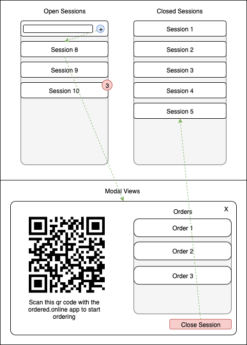

# ordered online order service

This django based micro service provides an API to obtain orders placed at a location.

## Code Idea and Schematic Layout



The core idea of this service is to allow order placement. Here is the workflow:
1. The location representative authenticates himself and opens the order panel. The order panel contains `OrderSessions`, which each have a state: `open` and `closed` (see layout).
2. In the order panel, the location representative creates an order session with an identifier (e.g. "Table 2"). The order session is now `open`. The order session automatically obtains a (qr renderable) code from the `codes` service. In the UI of the location representative, a WebSocket ist opened, which connects to the endpoint for the order session and therefore receives all messages, which are related to this order session (i.e., orders themselves). 
3. Clicking the order session in the leftmost column triggers a modal to be presented, which contains the QR code.
4. User scans this QR code. The user connects to the same WebSocket channel by the obtained code, so that user and location representative are connected with each other from now on.
5. The user can order products (these products are inferred by the `products` service) and those orders are pushed to the corresponding WebSocket channel, so that they are displayable by the location representative's UI.
6. The location representative can see all orders of a session in a modal, which is presented, when clicking on the corresponding session.
7. The location representative can close the order session. This posts a message to the user's WebSocket connection and triggers a UI change on the user side, which indicates, that the session was closed.

## Technology Stack

- Python 3
- Django
- WebSockets
- Redis as the backend for Django Channels

## Quickstart

```
$ python3 -m pip install -r requirements.txt
```

Run the server in development mode.
```
$ cd codes
$ docker run -p 6379:6379 -d redis:2.8
$ python3 manage.py migrate
$ python3 manage.py runserver 127.0.0.1:8004
```

Make sure, that the channel layer can communicate with the redis service.
```
$ python3 manage.py shell

In [1]: import channels.layers                                                                                    

In [2]: channel_layer = channels.layers.get_channel_layer()                                                       

In [3]: from asgiref.sync import async_to_sync                                                                    

In [4]: async_to_sync(channel_layer.send)('test_channel', {'type': 'hello'})                                      

In [5]: async_to_sync(channel_layer.receive)('test_channel')     
                                                 
Out[5]: {'type': 'hello'}
```

In the debug configuration, we need:
- The `verification` service (by default on `127.0.0.1:8000`)
- The `locations` service (by default on `127.0.0.1:8001`)
- The `codes` service (by default on `127.0.0.1:8002`)
- The `orders` service itself on any arbitrary port other than 8000...8002, we use `127.0.0.1:8004` for this developer documentation

## API Endpoints

Following API Endpoints are supported:

### Create a session with `/orders/sessions/create/`
Create a session.
Method: POST

This endpoint is secured by verification. 
You need to pass the verification session key and the verification user_id. 

|Parameter|Explanation|
|-|-|
|user_id|User id for user verification.|
|session_key|Session key for user verification.|
|location_id|The id for the location.|
|name|A unique name for the session, e.g. "Table 1" or "Customer XY".|

Example session creation with `curl`:

```
curl -i -X POST -H 'Content-Type: application/json' -d '{
    "location_id": 1,
    "name": "Table 1",
    "user_id": 1,
    "session_key": "rjl9y6x6b35towopj9qp65mgj3xdq07c"
}' http://127.0.0.1:8004/orders/sessions/create/

{ 
   "success":true,
   "response":{ 
      "code":"ac35940dff4d472ce4801a154de92406f3163565",
      "name":"Table 1",
      "location_id":1,
      "state":"OPEN",
      "timestamp":"2019-10-30T08:51:01.491347+00:00",
      "orders":[ 

      ]
   }
}
```

Note, that the unique constraint is coupled to the location id. This means, that there can be two sessions with name "Table 1" but not for the same location.

Failure Responses:
- [IncorrectAccessMethod](#IncorrectAccessMethod) if the service was accessed with any other method than specified.
- [IncorrectCredentials](#IncorrectCredentials) if the passed credentials were incorrect.
- [MalformedJson](#MalformedJson) if the given Json was malformed.
- [VerificationServiceUnavailable](#VerificationServiceUnavailable) if the verification service could not be contacted.
- [LocationsServiceUnavailable](#LocationsServiceUnavailable) if the locations service could not be contacted.
- [CodeServiceUnavailable](#CodeServiceUnavailable) if the code service could not be contacted.
- [DuplicateSession](#DuplicateSession) if a unique constraint was violated.

### Get a session with `/codes/sessions/get/<session_code>/`
Gets a session, with all of its orders.
Methods: GET

Example request with `curl`:
```
curl -i -X GET http://127.0.0.1:8004/orders/sessions/get/ac35940dff4d472ce4801a154de92406f3163565/

{ 
   "success":true,
   "response":{ 
      "code":"ac35940dff4d472ce4801a154de92406f3163565",
      "name":"Table 1",
      "location_id":1,
      "state":"CLOSED",
      "timestamp":"2019-10-30T08:51:01.491347+00:00",
      "orders":[ 
         { 
            "id":2,
            "product_id":1,
            "session":"ac35940dff4d472ce4801a154de92406f3163565",
            "timestamp":"2019-10-30T08:56:08.905087+00:00"
         },
         { 
            "id":3,
            "product_id":1,
            "session":"ac35940dff4d472ce4801a154de92406f3163565",
            "timestamp":"2019-10-30T08:56:48.183929+00:00"
         },
         { 
            "id":4,
            "product_id":1,
            "session":"ac35940dff4d472ce4801a154de92406f3163565",
            "timestamp":"2019-10-30T08:56:50.206426+00:00"
         },
         { 
            "id":5,
            "product_id":2,
            "session":"ac35940dff4d472ce4801a154de92406f3163565",
            "timestamp":"2019-10-30T08:57:09.742687+00:00"
         }
      ]
   }
}
```

Failure Responses:
- [IncorrectAccessMethod](#IncorrectAccessMethod) if the service was accessed with any other method than specified.
- [SessionNotFound](#SessionNotFound) if the session could not be found.

### Close a session with `/orders/sessions/close/<session_code>/`

Close a session.
Methods: POST

Example request with `curl`:

```
curl -i -X POST http://127.0.0.1:8004/orders/sessions/close/ac35940dff4d472ce4801a154de92406f3163565/

{ 
   "success":true,
   "response":{ 
      "code":"ac35940dff4d472ce4801a154de92406f3163565",
      "name":"Table 1",
      "location_id":1,
      "state":"CLOSED",
      "timestamp":"2019-10-30T08:51:01.491347+00:00",
      "orders":[ 
         { 
            "id":2,
            "product_id":1,
            "session":"ac35940dff4d472ce4801a154de92406f3163565",
            "timestamp":"2019-10-30T08:56:08.905087+00:00"
         },
         { 
            "id":3,
            "product_id":1,
            "session":"ac35940dff4d472ce4801a154de92406f3163565",
            "timestamp":"2019-10-30T08:56:48.183929+00:00"
         },
         { 
            "id":4,
            "product_id":1,
            "session":"ac35940dff4d472ce4801a154de92406f3163565",
            "timestamp":"2019-10-30T08:56:50.206426+00:00"
         },
         { 
            "id":5,
            "product_id":2,
            "session":"ac35940dff4d472ce4801a154de92406f3163565",
            "timestamp":"2019-10-30T08:57:09.742687+00:00"
         }
      ]
   }
}
```

Failure Responses:
- [IncorrectAccessMethod](#IncorrectAccessMethod) if the service was accessed with any other method than specified.
- [SessionNotFound](#SessionNotFound) if the session could not be found.

### Create orders with `/orders/create/`
Create order for a given session.
Methods: POST

|Parameter|Explanation|
|-|-|
|product_id|The product id on which to place the order.|
|session_code|The session code for the session in which to place the order.|

Example request with `curl`:
```
curl -i -X POST -H 'Content-Type: application/json' -d '{
    "product_id":1337,
    "session_code": "ac35940dff4d472ce4801a154de92406f3163565"
}' http://127.0.0.1:8004/orders/create/

{ 
   "success":true,
   "response":{ 
      "code":"ac35940dff4d472ce4801a154de92406f3163565",
      "name":"Table 1",
      "location_id":1,
      "state":"OPEN",
      "timestamp":"2019-10-30T08:51:01.491347+00:00",
      "orders":[ 
         { 
            "id":1,
            "product_id":1337,
            "session":"ac35940dff4d472ce4801a154de92406f3163565",
            "timestamp":"2019-10-30T08:56:08.905087+00:00"
         }
      ]
   }
}
```

Failure Responses:
- [IncorrectAccessMethod](#IncorrectAccessMethod) if the service was accessed with any other method than specified.
- [MalformedJson](#MalformedJson) if the given Json was malformed.
- [SessionNotFound](#SessionNotFound) if a session with the given code could not be found.


## Debugging with the supplied debug template

WebSocket connections can be hard to debug via command line. 
To solve this problem, we supply a `debug_session` template with a basic websocket setup.
Simply run the server with `DEBUG=1` and visit `/orders/sessions/debug/<session_code>/` after creating a session via command line.
All updates should appear in the browser window and in the debug console.

## Failure Responses

Following failure responses are supported:

### IncorrectCredentials

Code: 403

```
{ 
   "success":false,
   "reason":"incorrect_credentials"
}
```

### MalformedJson

Code: 400

```
{
    "success":false,
    "reason":"malformed_json"
}
```

### SessionNotFound

Code: 404

```
{
    "success":false,
    "reason":"session_not_found"
}
```

### IncorrectAccessMethod

Code: 405

```
{ 
   "success":false,
   "reason":"incorrect_access_method"
}
```

### VerificationServiceUnavailable

Code: 503

```
{
    "success":false,
    "reason":"verification_service_unavailable"
}
```

### LocationsServiceUnavailable

Code: 503

```
{
    "success":false,
    "reason":"locations_service_unavailable"
}
```

### CodeServiceUnavailable

Code: 503

```
{
    "success":false,
    "reason":"code_service_unavailable"
}
```

### DuplicateSession

Code: 400

```
{
    "success":false,
    "reason":"duplicate_session"
}
```
